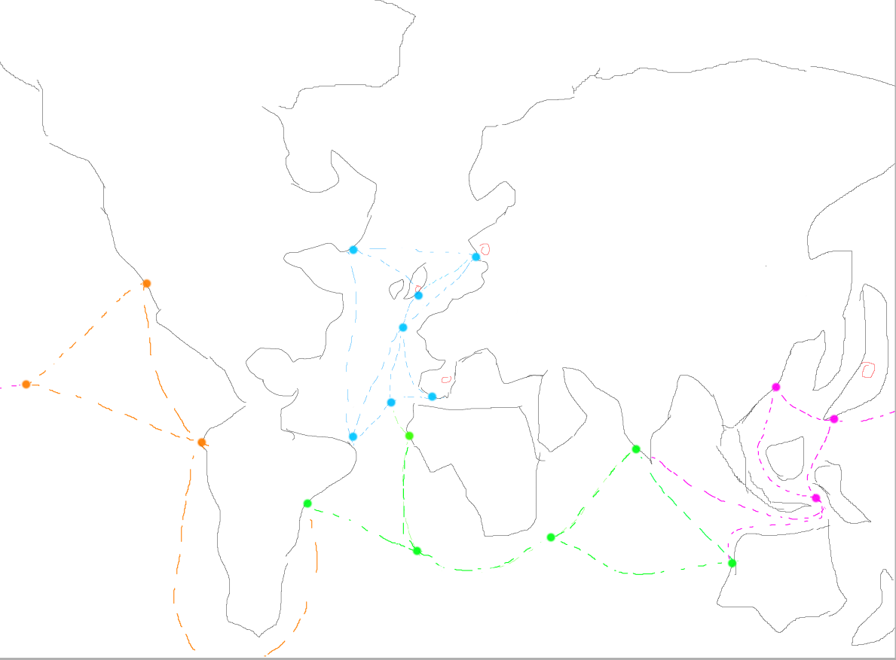

# 卡牌游戏

## 地图

# Model

> ## 枚举：`Size`
> SAMLL, MIDDLE, LARGE

> ## 枚举：`PortType`
> COMMERCIAL, MILITARY

> ## 枚举：`CarryType`
> MATERIAL, COMMODITY, FINANCE

> ## 枚举:`WarBoatType`
> BARQUE, CARAVEL, GALEN, CLARK

> ## 枚举:`CountryName`
> SPAIN， NETHERLANDS， GREATBRITAIN， JAPAN

> ## Class : 国家(`Country`)
> ### Attributs :
> - 国家名字 name : CountryName
> - 城市 city : List\<City\>
> - 资金 finance : int
> - 工业原料 material : int
> - 船 boat : Boat
> - 科技 technology : int

> ## 类：港口 (`Port`)
> ### 字段：
> - 港口大小 (size): Size
> - 港口类型 (type)：PortType
> - 港口防御 (defense)：int
> - 防卫炮火 (ack)：int
> - 造船上限 boats limit : int
> - 船 (boats)：List\<Boat\>

> ## 类：城市 (`City`)
> ### 字段：
> - 城市规模 (size)：Size
> - 人口数 (population)：int
> - 港口 (ports)：List\<Port\>
> - 城墙防御 (defense)：int
> - 防卫炮火 (ack)：int
> ### 方法：
> - get/set/add/delete （根据类型进行最大值判断）

> ## 类：船 (`Boat`)
> ### 字段：
> - 规模 (size)：Size
> - 造价 (price)：int （单位：K）
> - 血量 (HP)：int
> ### 方法：
> - 获得基数 (`getBaseValue()`)
> - 获得系数 (`getCoefficient()`)

> ## 类：渔船 (`FishingBoat`) `extends` 船(`Boat`)
> ### 字段：
> - 渔获量 fishCatch : int
> ### 方法：
> - 获得基数 (`getBaseValue()`)
> - 获得系数 (`getCoefficient()`)

> ## class : 商船 (`MerchantBoat`) `extends` (`Boat`)
> ### Attributs:
> -   搭载种类 : carryType : CarryType
> ### 方法：
> - 获得基数 (`getBaseValue()`)
> - 获得系数 (`getCoefficient()`)
> - 获得运载上限(`getCarryLimit()`)

> ## class : 军舰 (`WarBoat`) `extends` (`Boat`)
> ### Attributs:
>  - 种类 (type) : WarBoatType
> ### 方法：
> - 获得基数 (`getBaseValue()`)
> - 获得系数 (`getCoefficient()`)
> - 获得陆军运载量 (`getArmyCarry() :`)
> - 获得水手运载量 (`getSailorCarry() :`)
